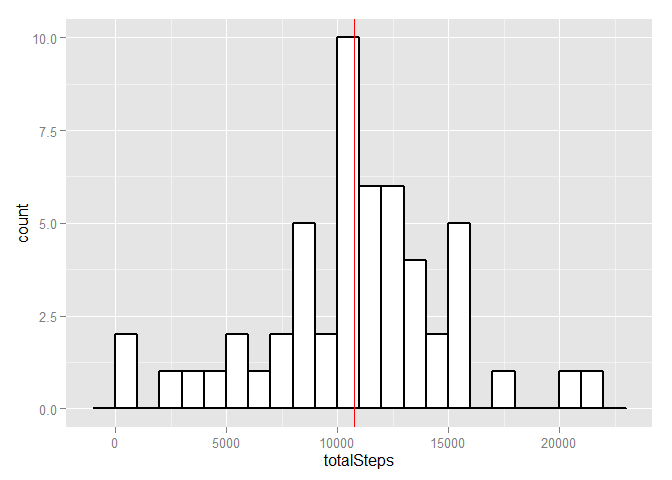
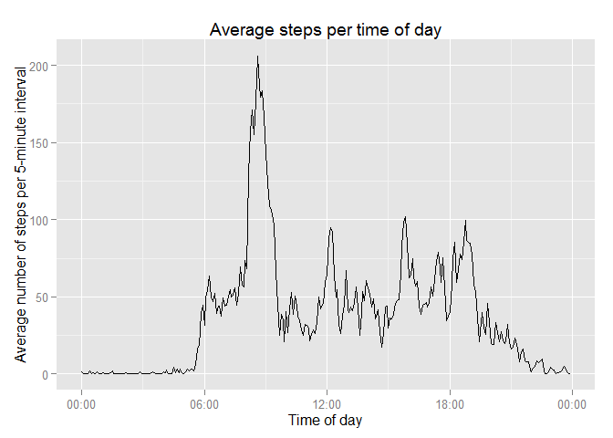
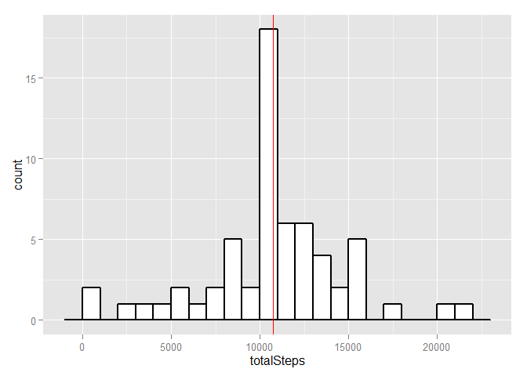
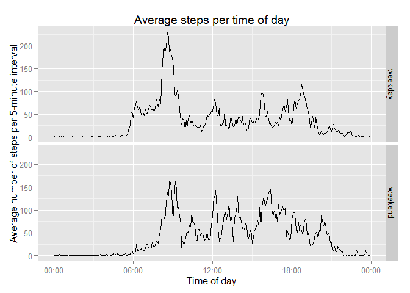

# Reproducible Research: Peer Assessment 1


## Loading and preprocessing the data

Let's start the analysis by loading the dataset that is provided with the question. The dataset is provided as a compressed comma-separated values file from [this location](https://d396qusza40orc.cloudfront.net/repdata%2Fdata%2Factivity.zip). To start the analysis, we'll download the file, and uncompress it to the `dataset` folder if it doesn't already exist locally.


```r
library(dplyr)
```

```
## Warning: package 'dplyr' was built under R version 3.1.2
```

```
## 
## Attaching package: 'dplyr'
## 
## The following object is masked from 'package:stats':
## 
##     filter
## 
## The following objects are masked from 'package:base':
## 
##     intersect, setdiff, setequal, union
```

```r
library(ggplot2)
```

```
## Warning: package 'ggplot2' was built under R version 3.1.2
```

```r
library(scales)
```

```
## Warning: package 'scales' was built under R version 3.1.2
```

```r
datasetFolder <- "dataset"
datasetFile <- paste(datasetFolder, "activity.csv", sep = "/")

if (!file.exists(datasetFolder)) {
    dir.create(datasetFolder);
}

# Download dataset if it doesn't exist
if (!file.exists(datasetFile)) {
    localZip <- "activity.zip"
    remoteZip <- "https://d396qusza40orc.cloudfront.net/repdata%2Fdata%2Factivity.zip"
    download.file(remoteZip, destfile = localZip, method = "curl")
    unzip(localZip, exdir = datasetFolder)
    unlink(localZip);
}

# Load the data into memory
data <- read.csv(datasetFile, header = TRUE)
dataWithoutNA <- data[!is.na(data$steps),]

# Aggregate the number of steps per day
stepsPerDay <- dataWithoutNA %>%
  group_by(date) %>%
  summarize(totalSteps = sum(steps))
```

## What is mean total number of steps taken per day?

Now that we have the data loaded, we can start answering the questions. First of all, let's look at the distribution of the number of steps, by plotting a histogram of the number of steps per day. In this chart let's also add a line indicating the mean of the total steps.


```r
g <- ggplot(stepsPerDay, aes(x = totalSteps))
g <- g + geom_histogram(binwidth = 1000, fill = "white", color = "black", size = 1)
g <- g + geom_vline(color = "red", aes(xintercept = mean(totalSteps)))
g
```

 

The chart shows the mean a little under 11000 steps, let's get the accurate value:


```r
totalStepsMean <- mean(stepsPerDay$totalSteps)
totalStepsMedian <- median(stepsPerDay$totalSteps)
```

Based on the code above, we can see that the mean total steps per day is 10766.19, and its median is 10765.

## What is the average daily activity pattern?

Now lets check the average daily pattern for the dataset, to try to understand the distribution of the number of steps taken based on the time of the day. To do that, let's summarize the data, this time grouping by the interval. We'll also convert the numeric *interval* column in the data frame into a character column which better represents the time of the day:


```r
stepsPerInterval <- dataWithoutNA %>%
    group_by(interval) %>%
    summarise(avgSteps = mean(steps))
intervalHours <- stepsPerInterval$interval %/% 100
intervalMinutes <- stepsPerInterval$interval %% 100
stepsPerInterval$timeOfDay <- as.POSIXct("2015-01-01") +
    intervalHours * 60 * 60 +
    intervalMinutes * 60
rm(list = c("intervalHours", "intervalMinutes")) # Clean-up temporary variables
```

And now we can plot the number of steps per time of day to better analyze the daily activity pattern:


```r
ggplot(stepsPerInterval, aes(x = timeOfDay, y = avgSteps, group = 1)) +
    geom_line() +
    ggtitle("Average steps per time of day") +
    xlab("Time of day") +
    ylab("Average number of steps per 5-minute interval") +
    scale_x_datetime(labels = date_format("%H:%M"))
```

 

From this chart we can see that the most active period of the day for the subject from this dataset is early in the morning, between 8:15 and 9:00, followed by some spikes around noon (lunch time), in the middle of the afternoon (maybe a coffee break) and a little after 6:00 (dinner time). For a more accurate value of the interval with the maximum number of steps, we can find it by ordering the aggregate data set based on the average number of steps:


```r
stepsPerInterval[order(-stepsPerInterval$avgSteps)[1],]
```

```
## Source: local data frame [1 x 3]
## 
##   interval avgSteps           timeOfDay
## 1      835 206.1698 2015-01-01 08:35:00
```

## Imputing missing values

In the analysis so far we've ignored the dates without data. But that leaves out a lot of observations:


```r
totalNA <- sum(is.na(data$steps))
paste("There are", totalNA, "missing values in the dataset.")
```

```
## [1] "There are 2304 missing values in the dataset."
```

We'll now fill those up, by using the average number of steps per (5-minute) period of the day to fill the missing slots. We'll do that by merging the original data set with the summarized version of steps per interval.


```r
stepsPerIntervalOnly <- stepsPerInterval # copy the result of the previous computation
stepsPerIntervalOnly$timeOfDay <- NULL       # Remove unecessary columns
dataComplete <- merge(data, stepsPerIntervalOnly, by = "interval")

# Now copy the averages to the missing values
dataComplete[is.na(dataComplete$steps), "steps"] <-
    round(dataComplete[is.na(dataComplete$steps), "avgSteps"], 0)
```

Now with the complete data we can calculate the number of steps per day again:


```r
# Aggregate the number of steps per day
stepsPerDayComplete <- dataComplete %>%
  group_by(date) %>%
  summarize(totalSteps = sum(steps))
```

And with that we can plot the histogram of the number of steps:

```r
g <- ggplot(stepsPerDayComplete, aes(x = totalSteps))
g <- g + geom_histogram(binwidth = 1000, fill = "white", color = "black", size = 1)
g <- g + geom_vline(color = "red", aes(xintercept = mean(totalSteps)))
g
```

 

The chart shows an increase in the number of days with 10000-11000 steps, but otherwise the shape of the histogram is similar. Likewise, the mean and median of the data are very similar to the original one:


```r
totalStepsMean <- mean(stepsPerDayComplete$totalSteps)
totalStepsMedian <- median(stepsPerDayComplete$totalSteps)
```

Based on the code above, we can see that after filling the missing data, the mean total steps per day is 10765.64, and its median is 10762.

## Are there differences in activity patterns between weekdays and weekends?

The last analysis we'll do in the data is to see if there are changes in the daily steps patterns between weekdays and weekends. To do that, we'll add another column, based on the date of the observation:


```r
isWeekday <- function(date) {
    wday <- as.POSIXlt(date)$wday
    wday >= 1 & wday <= 5
}

#order by date
dataComplete <- dataComplete[order(dataComplete$date, dataComplete$interval),]

# Add additional column
dataComplete$weekdayType <- as.factor(ifelse(isWeekday(dataComplete$date), "weekday", "weekend"))
```

And we can now calculate the number of steps per interval and weekday type.


```r
stepsPerIntervalComplete <- dataComplete %>%
    group_by(interval, weekdayType) %>%
    summarise(avgSteps = mean(steps))
intervalHours <- stepsPerIntervalComplete$interval %/% 100
intervalMinutes <- stepsPerIntervalComplete$interval %% 100
stepsPerIntervalComplete$timeOfDay <- as.POSIXct("2015-01-01") +
    intervalHours * 60 * 60 +
    intervalMinutes * 60
rm(list = c("intervalHours", "intervalMinutes")) # Clean-up temporary variables
```

Finally, let's plot the two charts side-by-side to see if there is any difference between weekdays and weekends:


```r
ggplot(stepsPerIntervalComplete, aes(x = timeOfDay, y = avgSteps, group = 1)) +
    geom_line() +
    facet_grid(weekdayType ~ .) +
    ggtitle("Average steps per time of day") +
    xlab("Time of day") +
    ylab("Average number of steps per 5-minute interval") +
    scale_x_datetime(labels = date_format("%H:%M"))
```

 

What we can see from the chart above is that while the number of steps in the higher interval (>200 around 8:50) during weekdays is greater, the user activity is more distributed in the weekends, with 100+ steps intervals in more parts of the day.
